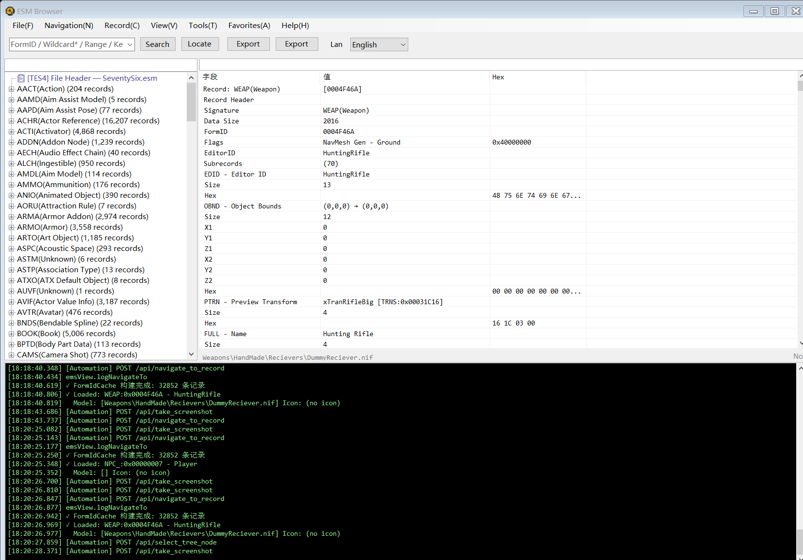

# Fallout76 Data Tools

> [中文文档](README_CN.md)

A desktop tool for parsing and browsing Fallout 76 ESM (Elder Scrolls Master) files, similar to xEdit.

## Features

### Menu Bar: File · Navigation · Record · View · Tools · Favorites · Help

**File**
- `Open ESM` — load an ESM file for browsing
- `Add ESM` — load additional ESM files (multi-ESM simultaneous loading)
- `Reload` — reload the current ESM file
- `Export JSON` — export the current record as JSON
- `Export Screenshot` — export the current view as an image

**Navigation**
- `Back / Forward` — browser-style navigation history (`Alt+Left` / `Alt+Right`)
- `Recent` — list of recently viewed records for quick access

**Record**
- `Query by FormID` — jump to a record by hex/decimal FormID
- `Search Records` (`Ctrl+F`) — search by EditorID or name keyword
- `Advanced Search` (`Ctrl+Shift+F`) — type filters + deep subrecord full-text search
- `Field Search` — field-level search across all loaded ESMs
- `Locate in Tree` — highlight the current record in the tree
- `View References` — find all records that reference the current record
- `Compare Records` — side-by-side field diff of two records
- `Cross-ESM Compare` — multi-ESM field-level diff (requires 2+ ESMs loaded)
- `Item Source Chain` — trace crafting recipes (COBJ), leveled lists (LVLI), vendor sources
- `OMOD Chain` — view all Object Modifications for a weapon/armor, grouped by slot keyword (WEAP/ARMO/NPC_)
- `NPC Equipment` — inspect outfits (OTFT), inventory (CNTO), death items, and template inheritance (NPC_ only)
- `Master Dependencies` — recursive ESM master-file dependency tree with load/exist/missing status
- `Unknown Fields` — detect unrecognized subrecord signatures

**View**
- `Expand / Collapse All` — expand or collapse all tree nodes
- `Log Panel` — toggle the bottom log panel

**Tools**
- `Strings Analyzer` — browse multi-language string database, export, wildcard search
- `Conflict Detection` — detect cross-ESM record conflicts
- `Error Check` — scan for data errors

**Favorites**
- Bookmark records into groups with color tags (Red / Orange / Green / Blue / Purple)
- Move between groups, quick navigation from menu

**Help**
- `Documentation` — open online documentation (opens Chinese docs for Chinese UI, English docs otherwise)
- `About` — version info, Bethesda copyright disclaimer, and auto-update check

### Right-Click Context Menus

**Tree Panel (left)**
- `View References` / `Item Source Chain` — quick access to analysis
- `Copy FormID` / `Copy EditorID`
- `Add to Favorites` / `Move to Group` / `Remove` / `Tag Color`
- `Export This Type (JSON)` / `Export This Type (CSV)` — batch export all records of a type
- `View Map` — open cell map viewer (CELL/WRLD)

**Detail Panel (right)**
- `Copy FormID` / `Jump to Record` — navigate to referenced record
- `Copy Field Value` / `Copy Node JSON` / `Copy Full JSON`

### Preview & Display

- Unified search box: hex FormID (`0x003B8C17`), decimal FormID, EditorID, or name keyword
- Tree-based record browsing with type filtering and detail filter
- Detail panel with Field / Value / Hex columns
- 3D model preview (NIF via WebView2)
- Texture preview (DDS)
- Cell map viewer

### Localization

- 13 languages: English, 简体中文, 繁體中文, 日本語, 한국어, Deutsch, Français, Español, Español (MX), Português (BR), Русский, Polski, Italiano

### Other

- Auto-update checker
- Self-contained single-file executable (no .NET runtime needed)

## Documentation

- [Overview](docs/en/01-overview.md)
- [File Menu](docs/en/02-file-menu.md) — Open, Add, Export
- [Navigation](docs/en/03-navigation.md) — Back/Forward, Recent History, Mouse Navigation
- [Record Menu](docs/en/04-record-menu.md) — Search, Query, References, Compare, Analysis
- [View Menu](docs/en/05-view-menu.md) — Expand/Collapse, Log Panel
- [Tools Menu](docs/en/06-tools-menu.md) — Strings Analyzer, Conflict Detection, Batch Export
- [Favorites & Shortcuts](docs/en/07-favorites-and-shortcuts.md) — Favorites, Color Tags, Context Menus, Shortcuts
- [Detail Panel](docs/en/08-detail-panel.md) — Detail Tree, FormID Links, Filtering, Copy
- [FAQ](docs/en/09-faq.md) — FAQ, Keyboard Shortcuts, Troubleshooting

## System Requirements

- Windows 10 / 11 (x64)
- No additional runtime required

## Download

See [Releases](https://github.com/BigMango/FalloutToolsPublish/releases) for the latest build.

## Usage

1. Download and extract the zip from Releases
2. Run `Fallout76Data.exe`
3. Open an ESM file via **File → Open ESM**
4. Browse records in the left tree, view details on the right
5. Use the search box to jump to a record by FormID, EditorID, or name

## Community

- QQ Group: **861631187**
- GitHub: [BigMango/FalloutToolsPublish](https://github.com/BigMango/FalloutToolsPublish)

## Changelog

See [CHANGELOG.md](CHANGELOG.md) for version history.

## License & Disclaimer

This tool is provided as-is for personal and community use.

This project is **not affiliated with, endorsed by, or connected to Bethesda Softworks, ZeniMax Media, or Microsoft**. "Fallout", "Fallout 76", "Elder Scrolls", and related names, logos and images are registered trademarks of their respective owners.

This tool does **not** distribute any copyrighted game data. Users must supply their own legally obtained copy of `SeventySix.esm` from a licensed Fallout 76 installation.
