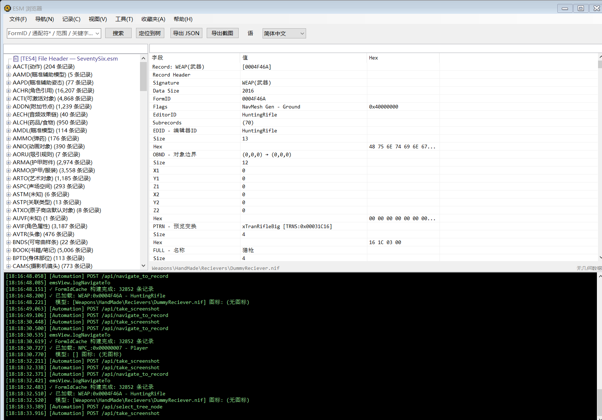

# Fallout76 数据工具

> [English](README.md)

一款用于解析和浏览 Fallout 76 ESM（Elder Scrolls Master）文件的桌面工具，功能对标 xEdit。

## 功能特性

### 菜单栏：文件 · 导航 · 记录 · 视图 · 工具 · 收藏夹 · 帮助

**文件**
- `打开 ESM` — 加载 ESM 文件进行浏览
- `添加 ESM` — 追加加载额外的 ESM 文件（支持多 ESM 同时加载）
- `重新加载` — 重新加载当前 ESM
- `导出 JSON` — 导出当前记录为 JSON
- `导出截图` — 导出当前视图为图片

**导航**
- `后退 / 前进` — 浏览器风格的导航历史（`Alt+Left` / `Alt+Right`）
- `最近浏览` — 最近查看过的记录列表，快速跳转

**记录**
- `按 FormID 查询` — 通过十六进制/十进制 FormID 跳转
- `搜索记录`（`Ctrl+F`）— 按 EditorID 或名称关键字搜索
- `高级搜索`（`Ctrl+Shift+F`）— 按类型过滤 + 子记录全文深度搜索
- `字段级搜索` — 跨所有已加载 ESM 的字段级搜索
- `定位到树` — 在左侧树中高亮当前记录
- `查看引用者` — 查找所有引用当前记录的记录
- `对比记录` — 两条记录的字段级差异对比
- `跨文件对比` — 多 ESM 字段级差异对比（需加载 2+ 个 ESM）
- `物品产出链` — 追踪制造配方（COBJ）、等级列表（LVLI）、商人等来源
- `改装链` — 查看武器/护甲的所有 Object Modification，按槽位关键词分组（WEAP/ARMO/NPC_）
- `NPC 装备` — 检查服装（OTFT）、物品栏（CNTO）、死亡物品、模板继承关系（仅 NPC_）
- `Master 依赖链` — 递归展示 ESM 的 master 依赖关系树，颜色标识加载/存在/缺失状态
- `未识别字段` — 检测未识别的子记录签名

**视图**
- `展开 / 折叠全部` — 展开或折叠所有树节点
- `日志面板` — 显示/隐藏底部日志窗口

**工具**
- `字符串分析器` — 浏览多语言字符串数据库，支持导出、通配符搜索
- `冲突检测` — 检测跨 ESM 记录冲突
- `错误检查` — 扫描数据错误

**收藏夹**
- 将记录收藏到分组，支持颜色标签（红 / 橙 / 绿 / 蓝 / 紫）
- 在分组之间移动，菜单快速导航

**帮助**
- `说明文档` — 打开在线文档（中文界面打开中文文档，其他语言打开英文文档）
- `关于` — 版本信息、Bethesda 版权声明、自动更新检测

### 右键菜单

**树形面板（左侧）**
- `查看引用者` / `物品产出链` — 快速进入分析功能
- `复制 FormID` / `复制 EditorID`
- `添加到收藏夹` / `移动分组` / `移除收藏` / `标记颜色`
- `导出此类型 (JSON)` / `导出此类型 (CSV)` — 批量导出某类型的所有记录
- `查看地图` — 打开 CELL/WRLD 地图查看器

**详情面板（右侧）**
- `复制 FormID` / `跳转到此记录` — 导航到引用的记录
- `复制字段值` / `复制节点 JSON` / `复制完整 JSON`

### 预览与显示

- 统一搜索框：支持十六进制 FormID（`0x003B8C17`）、十进制 FormID、EditorID、名称关键字
- 树形记录浏览，支持类型过滤和详情筛选
- 详情面板显示字段 / 值 / Hex 三列
- 3D 模型预览（NIF 格式，基于 WebView2）
- 贴图预览（DDS 格式）
- 地图查看器

### 多语言支持

- 13 种语言：English、简体中文、繁體中文、日本語、한국어、Deutsch、Français、Español、Español (MX)、Português (BR)、Русский、Polski、Italiano

### 其他

- 自动更新检测
- 单文件自包含可执行程序（无需安装 .NET 运行时）

## 详细文档

- [功能概述](docs/zh/01-概述.md)
- [文件菜单](docs/zh/02-文件菜单.md) — 打开、添加、导出
- [导航菜单](docs/zh/03-导航菜单.md) — 前进后退、最近浏览、鼠标导航
- [记录菜单](docs/zh/04-记录菜单.md) — 搜索、查询、引用、对比、分析
- [视图菜单](docs/zh/05-视图菜单.md) — 展开折叠、日志面板
- [工具菜单](docs/zh/06-工具菜单.md) — 字符串分析、冲突检测、批量导出
- [收藏夹与快捷操作](docs/zh/07-收藏夹与快捷操作.md) — 收藏夹、颜色标记、右键菜单、快捷键
- [详情面板与交互](docs/zh/08-详情面板与交互.md) — 详情树、FormID 链接、过滤、复制
- [常见问题](docs/zh/09-常见问题.md) — FAQ、快捷键速查、故障排除

## 系统要求

- Windows 10 / 11（x64）
- 无需额外运行时

## 下载

前往 [Releases](https://github.com/BigMango/FalloutToolsPublish/releases) 下载最新版本。

## 使用方法

1. 从 Releases 下载 zip 并解压
2. 运行 `Fallout76Data.exe`
3. 通过 **文件 → 打开 ESM** 加载 ESM 文件
4. 在左侧树形结构中浏览记录，右侧查看详情
5. 使用搜索框通过 FormID、EditorID 或名称快速跳转

## 交流群

- QQ 群: **861631187**
- GitHub: [BigMango/FalloutToolsPublish](https://github.com/BigMango/FalloutToolsPublish)

## 更新日志

详见 [CHANGELOG_CN.md](CHANGELOG_CN.md)。

## 许可与免责声明

本工具仅供个人及社区使用。

本项目与 Bethesda Softworks、ZeniMax Media 或 Microsoft **无任何关联、授权或背书关系**。“Fallout”、“Fallout 76”、“Elder Scrolls” 及相关名称、标志和图像均为各自所有者的注册商标。

本工具 **不分发** 任何受版权保护的游戏数据。用户需自行提供通过合法渠道获得的 Fallout 76 安装目录中的 `SeventySix.esm` 文件。
