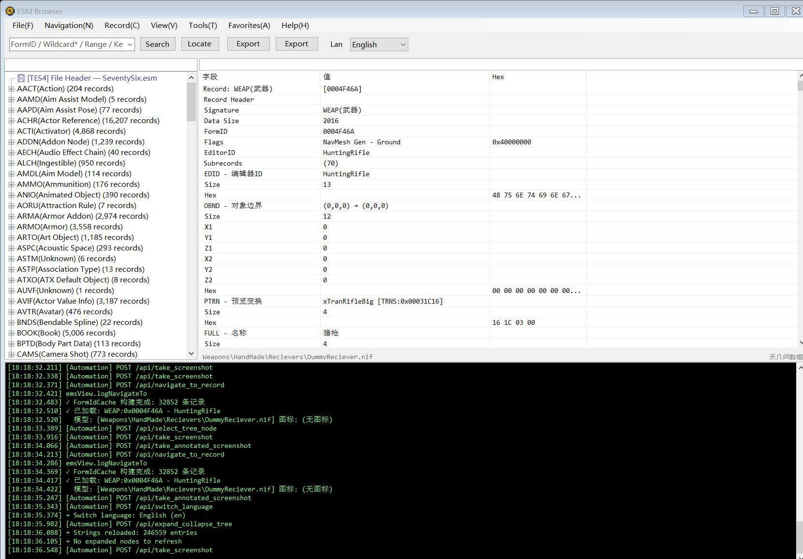
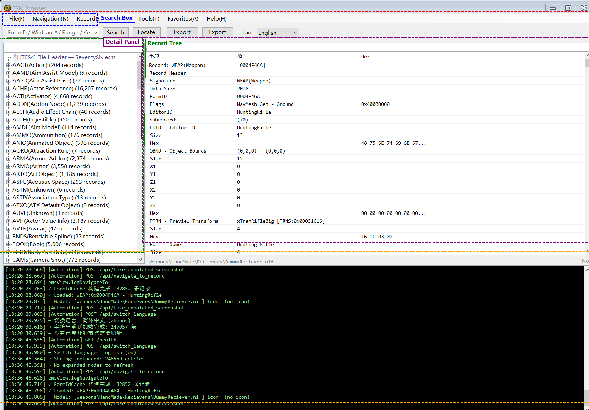

# Fallout 76 Data Tools — Overview

## Introduction

Fallout 76 Data Tools is a desktop application for parsing, browsing and analyzing Fallout 76 ESM (Elder Scrolls Master) data files. Comparable to xEdit, it provides full record browsing, field parsing, FormID navigation, reference lookup, record comparison, item source chain analysis, 3D model preview, and more.

## System Requirements

- **OS**: Windows 7 SP1 or later (Windows 10/11 recommended)
- **Runtime**: .NET 10 Desktop Runtime
- **Memory**: 4GB+ recommended (loading a full ESM uses ~1-2GB)
- **Game Data**: Requires `SeventySix.esm` from the Fallout 76 installation directory

## Quick Start

1. On launch, the program auto-detects the Fallout 76 installation path and loads `SeventySix.esm`
2. If not detected, manually select the Data folder containing `SeventySix.esm`
3. Once loaded, the left panel shows all record types; the right panel shows record details

## Interface Layout





```
┌──────────────────────────────────────────────────────────────┐
│  Menu: File | Navigation | Record | View | Tools | Favorites | Help │
├──────────────────────────────────────────────────────────────┤
│  Toolbar: [Search Box] [Search] [Locate] [Export JSON] [Screenshot] [Language] │
├────────────────┬─────────────────────────────────────────────┤
│  Left Panel     │  Right Panel                                │
│                │                                             │
│  [Filter Box]   │  [Field Filter Box]                         │
│  Record Tree    │  Detail Tree (Field | Value | Hex)          │
│  - WEAP (50)   │  ├── Record Header                          │
│  - ARMO (30)   │  ├── EDID - EditorID                        │
│  - NPC_ (20)   │  ├── FULL - Name                            │
│    ...         │  └── ...                                    │
│                ├─────────────────────────────────────────────┤
│                │  3D Model Preview / Texture Preview          │
├────────────────┴─────────────────────────────────────────────┤
│  Log Panel (black background, green text)                     │
├──────────────────────────────────────────────────────────────┤
│  Status Bar: Status message                        [Progress] │
└──────────────────────────────────────────────────────────────┘
```

## Feature Summary

| Category | Features |
|----------|----------|
| **File Management** | Open/Add/Reload ESM, Export JSON/Screenshot |
| **Navigation** | Back/Forward, Recent History, Mouse Button 4/5, Alt+Left/Right |
| **Search** | Keyword, Wildcard, FormID Range, Regex, Advanced Search, Field Search |
| **Record Analysis** | View References, Compare Records, Cross-ESM Compare, Item Source Chain, OMOD Chain, NPC Equipment, Leveled Lists |
| **Favorites & Tags** | Bookmark groups, Color tags (Red/Orange/Green/Blue/Purple) |
| **Export** | Single-type JSON/CSV, Batch CSV, JSON Copy |
| **Tools** | Strings Analyzer, Conflict Detection, Error Check, Master Dependency Chain |
| **Interaction** | FormID blue hyperlinks, Double-click/Ctrl+Click navigation, Hover tooltips, Hand cursor |
| **Preview** | 3D Model preview (NIF→GLB), Texture preview |
| **Localization** | 14 UI languages (Chinese/English/Japanese/Korean/French/German/Russian/Spanish/Italian/Portuguese/Polish/Traditional Chinese/Latin American Spanish) |

## Documentation

- [02-file-menu](02-file-menu.md) — File open, add, export
- [03-navigation](03-navigation.md) — Back/Forward, recent history, mouse navigation
- [04-record-menu](04-record-menu.md) — Search, query, references, compare, analysis
- [05-view-menu](05-view-menu.md) — Expand/Collapse, log panel
- [06-tools-menu](06-tools-menu.md) — Strings analyzer, conflict detection, batch export
- [07-favorites-and-shortcuts](07-favorites-and-shortcuts.md) — Favorites, color tags, context menus, shortcuts
- [08-detail-panel](08-detail-panel.md) — Detail tree, FormID links, filtering, copy
- [09-faq](09-faq.md) — FAQ, keyboard shortcuts, troubleshooting
