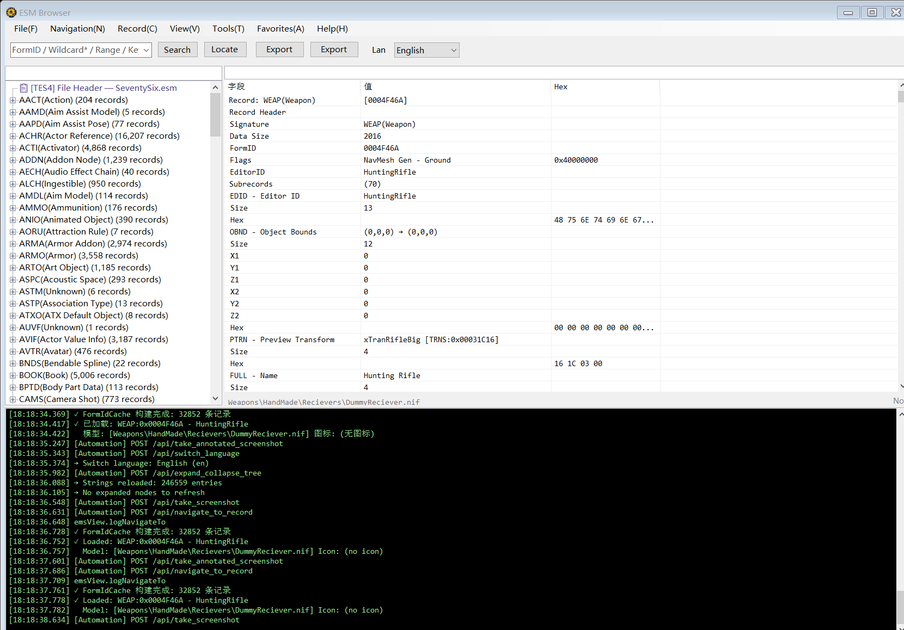

# File Menu

Menu path: **File(&F)**

## Open ESM (&O)

- **Function**: Opens a file dialog to select and load an `.esm` file
- **Supported formats**: ESM (Elder Scrolls Master) files
- **Loading process**:
  1. Read TES4 header record (version, total records, Master dependency list)
  2. Build or load cached record index (first load is slower; subsequent loads use cache)
  3. Load strings database (`strings.db`; auto-builds from BA2 if missing)
  4. Build the record type tree in the left panel
- **Note**: Opening a new ESM replaces all currently loaded data. To view multiple ESMs simultaneously, use "Add ESM"

## Add ESM (&A)

- **Function**: Load an additional ESM file alongside the currently loaded one
- **Prerequisite**: A main ESM must already be loaded
- **Use cases**:
  - Multi-ESM cross-reference search
  - Cross-file comparison (requires at least 2 ESMs)
  - Conflict detection
- **Note**: Records from the added ESM are merged into the tree; search and reference operations span all loaded ESMs

## Reload (&R)

- **Function**: Reload the current ESM file
- **Use case**: Refresh data after the ESM has been externally modified

## Export JSON (&J)

- **Prerequisite**: A record must be currently displayed in the detail panel
- **Function**: Export the current record's detail tree as a structured JSON file
- **Content**: All fields, subrecords, and their parsed values
- **Output**: Save dialog to choose destination path

## Export Screenshot (&I)

- **Prerequisite**: A record must be currently displayed
- **Function**: Render the current detail tree as a high-resolution image
- **Process**:
  1. Expand all tree nodes
  2. Calculate full content dimensions
  3. Render as PNG image
- **Limitation**: Height is capped for very large content to prevent memory overflow
- **Output**: Save dialog to choose destination path

## Exit (&X)

- **Function**: Close the ESM Browser window
