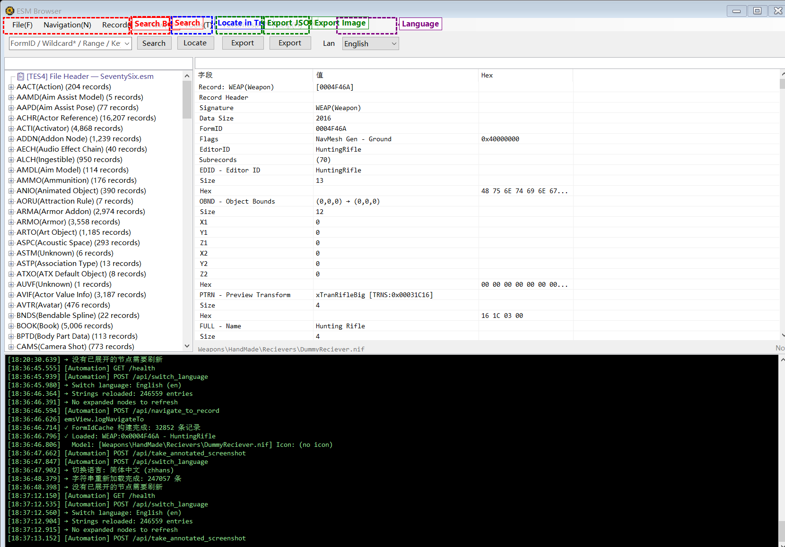

# Navigation Menu

Menu path: **Navigation(&N)**

## Back (&B)

- **Shortcut**: `Alt + Left Arrow`
- **Mouse**: Mouse Button 4 (XButton1 / Back button)
- **Function**: Return to the previously viewed record
- **Note**: Works like a browser's back button. Every jump via search, double-click, Ctrl+Click, etc. is recorded in the navigation history

## Forward (&F)

- **Shortcut**: `Alt + Right Arrow`
- **Mouse**: Mouse Button 5 (XButton2 / Forward button)
- **Function**: Navigate forward (available only after going back)
- **Note**: Works like a browser's forward button

## Mouse Side Button Navigation

The application supports back/forward navigation using mouse side buttons from **anywhere in the window**:

- **XButton1 (Button 4 / Back)**: Same as "Back"
- **XButton2 (Button 5 / Forward)**: Same as "Forward"

This is implemented via Windows message-level interception (`WM_APPCOMMAND`), so mouse side buttons work regardless of whether the left tree, right detail panel, or search box has focus.

## Recent History (&H)

- **Function**: Displays a list of recently viewed records (up to 20)
- **Action**: Click any item in the menu to jump to that record
- **Shortcut**: `F3` — Cycle through recently viewed records
- **Management**: "Clear History" option at the bottom of the menu

## Navigation Button States

- The Back button is disabled (grayed out) when the history is empty or already at the beginning
- The Forward button is disabled when there is no forward history
- The status bar shows current navigation position information
