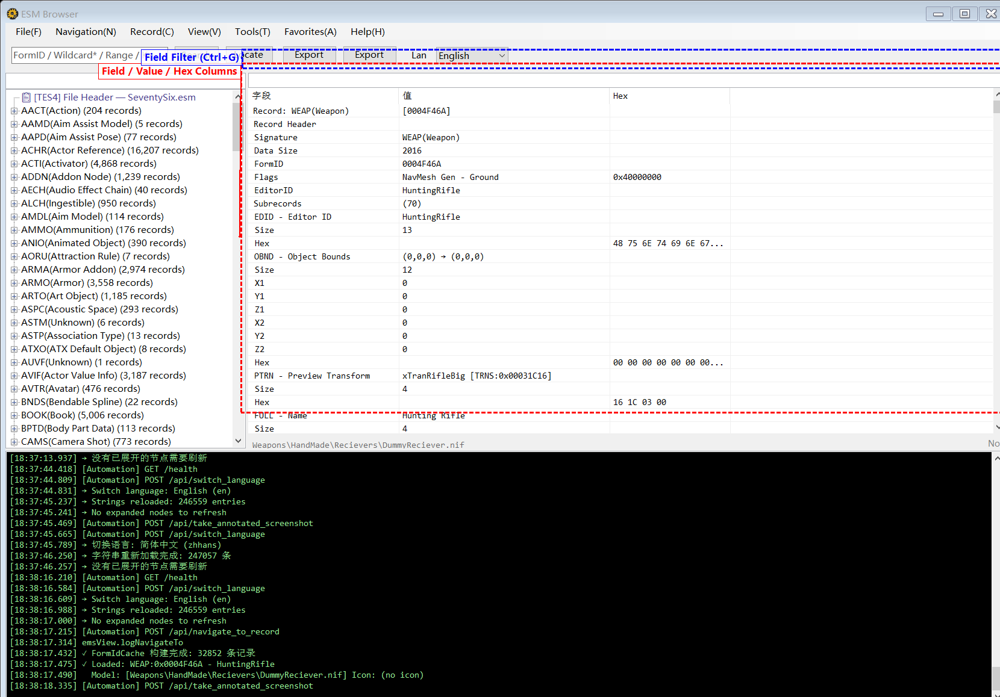
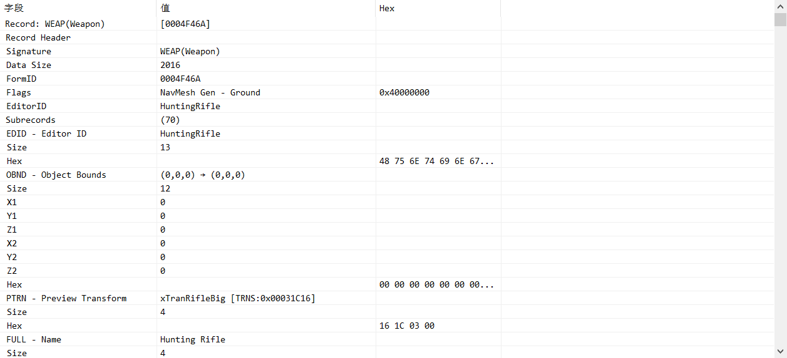

# Detail Panel & Interaction



## Detail Tree Structure

The right detail panel uses a TreeListView (ObjectListView) control with three columns:

| Column | Description |
|--------|-------------|
| **Field** | Subrecord signature and field name (e.g. `EDID - EditorID`, `FULL - Name`) |
| **Value** | Parsed human-readable value |
| **Hex** | Raw hexadecimal data |

### Record Header

Each record's detail tree starts with the Record Header:
- Record Signature (type)
- FormID
- Flags (record flag bits)
- Version

### Subrecord Parsing

The program includes extensive subrecord parsing logic that converts raw binary data into readable formats:
- Basic types: strings, integers, floats, FormID references
- Compound structures: OBND (bounding box), ACBS (actor base data), DNAM (weapon/armor data), etc.
- DATA specialization: Custom parsing for WTHR (weather), REGN (region), HAZD (hazard), etc.
- FO76-specific: PAHD, OBST, CTRN, FFEF, AIID, PHST and other Fallout 76 proprietary subrecords

## FormID Blue Links



### Detection

When the **Value** column contains a valid FormID reference (containing `0x`), it automatically displays as:
- **Blue text** with **underline** styling
- Visually identical to web hyperlinks

### Mouse Cursor

- When the mouse hovers over a blue FormID link, the cursor changes to a **hand** (pointer)
- Returns to default cursor when moved away

### Hover Tooltip

Hovering over a blue FormID link displays target record information:
```
[WEAP] 0x001234AB
WeaponLaserPistol
Laser Pistol
```

Tooltip content includes:
- Target record's type signature (e.g. [WEAP], [ARMO])
- FormID
- EditorID
- FullName (if string data is available)

### Jump Actions

Three ways to navigate via blue links:

| Action | Description |
|--------|-------------|
| **Double-click** | Double-click a blue link to jump to the target record |
| **Ctrl + Left-click** | Hold Ctrl and click a blue link to jump |
| **Right-click → Jump to Record** | Context menu navigation |

All jump actions are recorded in navigation history, allowing back/forward navigation.

## Left Tree Filter

- **Location**: Filter box at the top of the left panel
- **Shortcut**: `/` key to focus
- **Function**: Real-time filtering of records in the left tree
- **Debounce**: 250ms delay after input (prevents excessive refreshes)
- **Enter**: Press Enter to jump to the first matching record
- **Esc**: Press Esc to clear the filter

## Detail Field Filter

- **Location**: Filter box at the top of the right detail panel
- **Shortcut**: `Ctrl + G` to focus
- **Function**: Filter fields/values within the current record's detail tree
- **Debounce**: 300ms delay
- **Esc**: Press Esc to clear the filter

## Paged Loading

When a record type exceeds a threshold count, the left tree automatically paginates:
- Fixed number of records per page
- Displayed as `#1 - #500 (2000 records)` page nodes
- Click a page node to load that page's data
- Records within pages support normal selection and viewing

## 3D Model Preview

When the selected record contains a NIF model path, a 3D model preview appears below the detail panel:
- Automatically extracts NIF files from BA2 archives
- Converts to GLB format for rendering
- Supports exporting GLB files and preview screenshots

## Texture Preview

When a record references texture files, a texture preview is displayed:
- Supports extraction from BA2 archives
- Provides "Fit to Window" scaling

## TES4 File Header

After loading an ESM, the top of the left tree shows a `📋 [TES4] File Header` node:
- Click to view ESM file metadata
- Contains version number, total record count, Master dependency list
- Master list shows each dependency's index and filename

## CELL Map Visualization

For Worldspace nodes, right-click and select **View Map (&W)**:
- Displays a 2D map of all CELL positions within the worldspace
- Each CELL appears as a point on the map
- Click a CELL to jump to its record
- Coordinates come from XCLC subrecords
