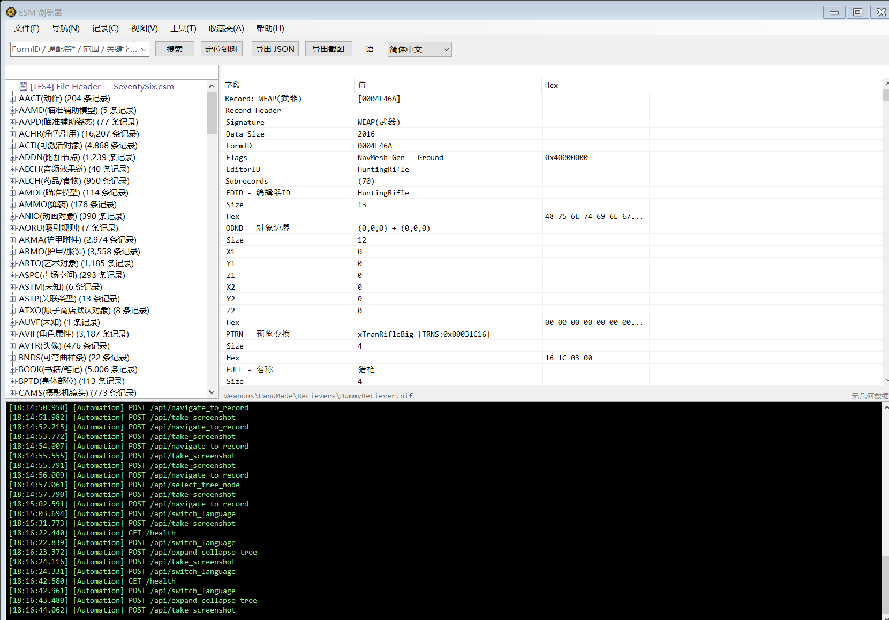
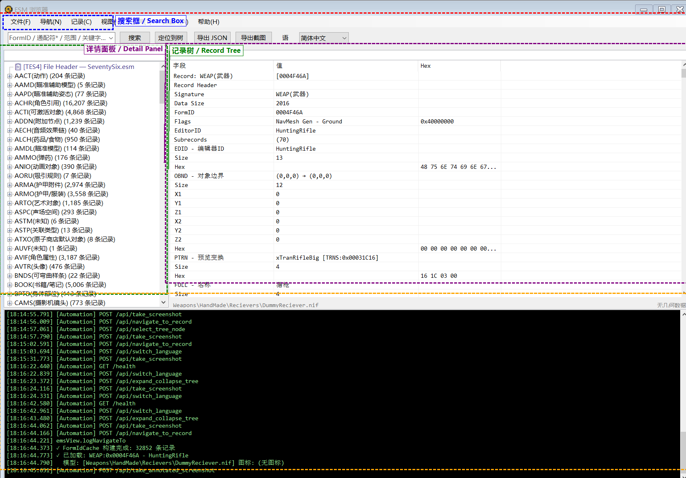

# Fallout 76 数据工具 — 功能概述

## 简介

Fallout 76 数据工具是一款用于解析、浏览和分析 Fallout 76 ESM（Elder Scrolls Master）数据文件的桌面应用程序。功能对标 xEdit，提供完整的记录浏览、字段解析、FormID 导航、引用查找、记录对比、物品产出链分析、3D 模型预览等能力。

## 系统要求

- **操作系统**: Windows 7 SP1 及以上（推荐 Windows 10/11）
- **运行时**: .NET 10 Desktop Runtime
- **内存**: 建议 4GB 以上（加载完整 ESM 时约需 1-2GB）
- **游戏数据**: 需要 Fallout 76 安装目录中的 `SeventySix.esm` 文件

## 快速开始

1. 启动程序后，自动检测 Fallout 76 安装路径并加载 `SeventySix.esm`
2. 若未自动检测到，可手动选择包含 `SeventySix.esm` 的 Data 文件夹
3. 加载完成后，左侧树显示所有记录类型，右侧显示记录详情

## 界面布局





```
┌─────────────────────────────────────────────────────────────┐
│  菜单栏: 文件 | 导航 | 记录 | 视图 | 工具 | 收藏夹 | 帮助  │
├─────────────────────────────────────────────────────────────┤
│  工具栏: [搜索框] [搜索] [定位到树] [导出JSON] [导出截图] [语言] │
├──────────────┬──────────────────────────────────────────────┤
│  左侧面板     │  右侧面板                                     │
│              │                                              │
│  [过滤框]     │  [字段过滤框]                                  │
│  记录类型树   │  详情树 (字段 | 值 | Hex)                       │
│  - WEAP (50) │  ├── Record Header                           │
│  - ARMO (30) │  ├── EDID - EditorID                         │
│  - NPC_ (20) │  ├── FULL - Name                             │
│    ...       │  └── ...                                     │
│              ├──────────────────────────────────────────────┤
│              │  3D 模型预览 / 纹理预览                         │
├──────────────┴──────────────────────────────────────────────┤
│  日志面板 (黑底绿字)                                          │
├─────────────────────────────────────────────────────────────┤
│  状态栏: 状态信息                                    [进度条]  │
└─────────────────────────────────────────────────────────────┘
```

## 主要功能一览

| 功能分类 | 功能项 |
|---------|--------|
| **文件管理** | 打开/添加/重新加载 ESM，导出 JSON/截图 |
| **导航** | 前进/后退，最近浏览，鼠标4/5键，Alt+左/右 |
| **搜索** | 关键字、通配符、FormID范围、正则表达式、高级搜索、字段级搜索 |
| **记录分析** | 查看引用者、对比记录、跨ESM对比、物品产出链、改装链、NPC装备、等级列表 |
| **收藏与标记** | 收藏夹分组、颜色标记（红/橙/绿/蓝/紫） |
| **导出** | 单类型 JSON/CSV 导出、批量 CSV 导出、JSON 复制 |
| **工具** | 字符串分析器、冲突检测、错误检查、Master 依赖链 |
| **交互** | FormID 蓝色链接跳转、双击/Ctrl+Click 导航、悬停提示、手型光标 |
| **预览** | 3D 模型预览（NIF→GLB）、纹理预览 |
| **多语言** | 支持 14 种语言界面（中/英/日/韩/法/德/俄/西/意/葡/波/繁中/拉美西） |

## 文档目录

- [02-文件菜单](02-文件菜单.md) — 文件打开、添加、导出
- [03-导航菜单](03-导航菜单.md) — 前进后退、最近浏览、鼠标导航
- [04-记录菜单](04-记录菜单.md) — 搜索、查询、引用、对比、分析
- [05-视图菜单](05-视图菜单.md) — 展开折叠、日志面板
- [06-工具菜单](06-工具菜单.md) — 字符串分析、冲突检测、批量导出
- [07-收藏夹与快捷操作](07-收藏夹与快捷操作.md) — 收藏夹、颜色标记、右键菜单、快捷键
- [08-详情面板与交互](08-详情面板与交互.md) — 详情树、FormID 链接、过滤、复制
- [09-常见问题](09-常见问题.md) — FAQ、快捷键速查、故障排除
