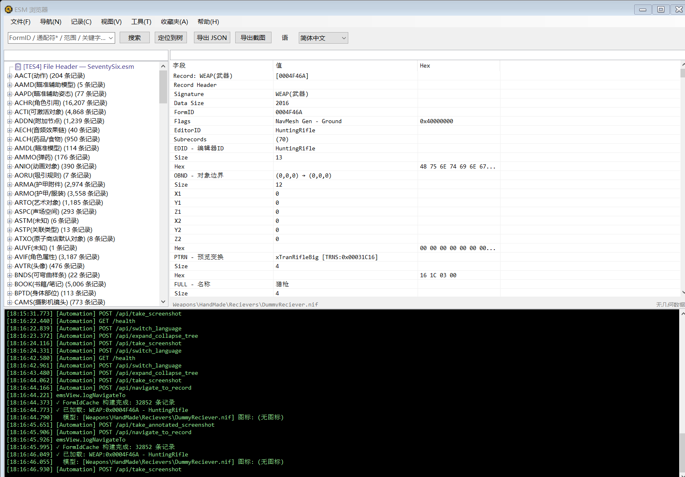

# 文件菜单 (File)

菜单路径: **文件(&F)**

## 打开 ESM (&O)

- **功能**: 弹出文件选择对话框，选择一个 `.esm` 文件并加载
- **支持格式**: ESM（Elder Scrolls Master）文件
- **加载流程**:
  1. 读取 TES4 头记录（版本号、记录总数、Master 依赖列表）
  2. 构建或加载缓存的记录索引（首次加载较慢，后续使用缓存）
  3. 加载字符串数据库（`strings.db`，若不存在且能找到 BA2 则自动构建）
  4. 构建左侧记录类型树
- **说明**: 打开新 ESM 会替换当前已加载的数据。若需同时查看多个 ESM，请使用「添加 ESM」

## 添加 ESM (&A)

- **功能**: 在已加载主 ESM 的基础上，追加加载一个额外的 ESM 文件
- **前提**: 必须先加载一个主 ESM 文件
- **用途**:
  - 多 ESM 交叉引用查找
  - 跨文件对比（需加载至少 2 个 ESM）
  - 冲突检测
- **说明**: 追加的 ESM 记录会合并到左侧树中，引用搜索和搜索操作会跨所有已加载的 ESM 执行

## 重新加载 (&R)

- **功能**: 重新加载当前 ESM 文件
- **用途**: 当 ESM 文件在外部被修改后，可用此功能刷新数据

## 导出 JSON (&J)

- **前提**: 需要先查询一条记录（右侧详情面板有数据）
- **功能**: 将当前记录的详情树导出为结构化 JSON 文件
- **导出内容**: 包含所有字段、子记录及其解析后的值
- **输出**: 弹出保存对话框，选择保存路径

## 导出截图 (&I)

- **前提**: 需要先查询一条记录
- **功能**: 将当前详情树渲染为高分辨率图片并保存
- **流程**:
  1. 展开所有树节点
  2. 计算完整内容尺寸
  3. 渲染为 PNG 图片
- **限制**: 内容过大时高度会被限制（避免内存溢出）
- **输出**: 弹出保存对话框，选择保存路径

## 退出 (&X)

- **功能**: 关闭 ESM 浏览器窗口
