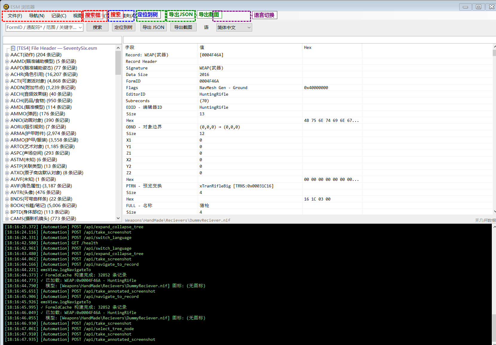

# 导航菜单 (Navigation)

菜单路径: **导航(&N)**

## 后退 (&B)

- **快捷键**: `Alt + ←`
- **鼠标**: 鼠标侧键 4（XButton1）
- **功能**: 返回上一条浏览过的记录
- **说明**: 与浏览器的后退行为一致。每次通过搜索、双击、Ctrl+Click 等方式跳转到新记录时，都会自动记录到导航历史中

## 前进 (&F)

- **快捷键**: `Alt + →`
- **鼠标**: 鼠标侧键 5（XButton2）
- **功能**: 前进到下一条记录（后退过之后才可用）
- **说明**: 与浏览器的前进行为一致

## 鼠标侧键导航

程序支持在 **任意位置** 使用鼠标侧键进行前进/后退导航：

- **XButton1（侧键 4 / 后退键）**: 等同于「后退」
- **XButton2（侧键 5 / 前进键）**: 等同于「前进」

这是通过 Windows 消息级别 (`WM_APPCOMMAND`) 拦截实现的，因此不管当前焦点在左侧树、右侧详情面板、还是搜索框中，鼠标侧键都能正常工作。

## 最近浏览 (&H)

- **功能**: 显示最近浏览过的记录列表（最多 20 条）
- **操作**: 点击菜单项中的记录即可跳转
- **快捷键**: `F3` — 循环跳转最近浏览的记录
- **管理**: 菜单底部有「清空历史」选项

## 导航按钮状态

- 后退按钮在导航历史为空或已在最前时自动禁用（灰色）
- 前进按钮在没有前进历史时自动禁用
- 状态栏会显示当前导航位置信息
