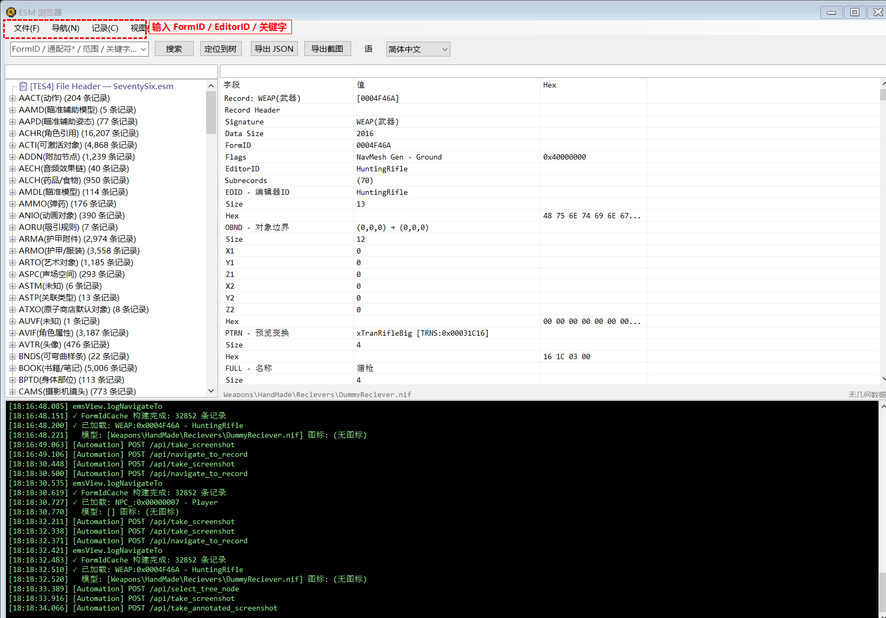

# 记录菜单 (Record)

菜单路径: **记录(&C)**

## 按 FormID 查询 (&Q)

- **功能**: 在顶部搜索框中输入 FormID（如 `003ABC` 或 `0x003ABC`），点击「搜索」按钮或按 Enter 执行查询
- **结果**: 直接定位到该 FormID 对应的记录，右侧显示详情

## 搜索记录 (&S)

- **快捷键**: `Ctrl + F`
- **功能**: 聚焦到顶部搜索框，支持 4 种搜索模式

### 搜索模式

**① 关键字搜索**
- 输入普通文本（如 `Laser` 或 `PowerArmor`）
- 在 EditorID 和 FullName 中模糊匹配

**② 通配符搜索**
- 使用 `*`（匹配任意字符）和 `?`（匹配单个字符）
- 示例: `Weapon*Laser`、`NPC_???`

**③ FormID 范围搜索**
- 格式: `0x1000-0x2000` 或 `1A00-2FFF`
- 搜索指定 FormID 范围内的所有记录

**④ 正则表达式搜索**
- 格式: `/pattern/`（用斜杠包裹）
- 示例: `/^Weapon_.+Laser$/`
- 支持完整的 .NET 正则表达式语法，不区分大小写

### 搜索结果窗口

- 搜索完成后弹出独立的结果窗口
- 显示 FormID、类型、EditorID、名称
- **双击** 或 **Enter** 跳转到对应记录
- 多 ESM 加载时会显示「来源 ESM」列

## 高级搜索 (&V)

- **快捷键**: `Ctrl + Shift + F`
- **功能**: 打开高级搜索对话框，提供更丰富的搜索条件组合
- **支持**: 按类型过滤、按字段值搜索等

## 字段级搜索 (&Z)

- **功能**: 打开字段级搜索窗口
- **用途**: 在指定类型的记录中搜索特定子记录字段的值
- **操作**:
  1. 选择记录类型（如 WEAP、ARMO）
  2. 输入搜索条件
  3. 搜索会遍历该类型所有记录的子记录数据

## 定位到树 (&L)

- **前提**: 已查询一条记录
- **功能**: 在左侧树中找到并选中当前查看的记录节点
- **流程**: 自动展开对应的类型节点（含分页节点），滚动并高亮目标节点

## 查看引用者 (&E)

- **功能**: 扫描所有已加载的 ESM，查找哪些记录引用了当前选中的记录
- **用途**: 了解一个物品/NPC/效果被哪些配方、容器、等级列表等引用
- **结果**: 弹出独立窗口，列出所有引用者
- **限制**: 压缩记录不在扫描范围内

## 对比记录 (&D)

- **前提**: 已查询一条记录
- **功能**: 打开记录对比窗口，可输入两个 FormID 进行并排对比
- **显示**: 左右分栏显示两条记录的子记录，差异高亮

## 跨文件对比 (&X)

- **前提**: 需加载至少 2 个 ESM 文件
- **功能**: 将同一 FormID 在两个不同 ESM 中的数据进行对比
- **用途**: 查看 mod 或补丁对某条记录做了哪些修改

## 物品产出链 (&P)

- **前提**: 已选择一条记录
- **功能**: 分析该物品的产出来源链
- **展示**: 追溯配方（COBJ）、容器（CONT）、NPC 掉落、等级列表（LVLI）等所有可能获取该物品的途径

## 改装链 (&O)

- **前提**: 已选择一条记录
- **功能**: 展示武器/装甲的 OMOD（Object Modification）改装链
- **用途**: 查看某武器/装甲可用的所有改装选项及其效果

## NPC 装备 (&N)

- **前提**: 已选择一条 NPC_ 类型记录
- **功能**: 展示 NPC 的完整装备列表
- **显示**: 穿戴的装甲、武器、弹药等，附带各项的详细信息

## 等级列表 (&L)

- **前提**: 已选择一条 LVLI / LVLN / LVSP 类型记录
- **功能**: 递归展开等级列表的完整内容
- **显示**: 以树形结构展示各等级条目、概率权重、嵌套的子等级列表

## Master 依赖链 (&M)

- **功能**: 显示当前加载的 ESM 的 Master 依赖关系
- **展示**: 各 ESM 文件之间的依赖关系图

## 未识别字段 (&U)

- **功能**: 列出当前视图中所有未在 `subrecord-fields.*.json` 中注册的子记录签名
- **用途**: 辅助逆向工程和字段文档完善
- **输出**: 显示未识别签名列表，可据此补充字段定义文件
