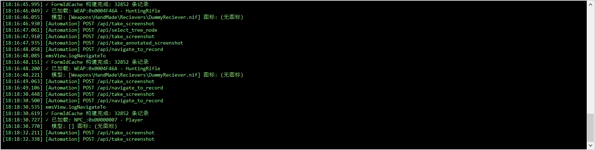

# 视图菜单 (View)

菜单路径: **视图(&V)**

## 展开全部节点 (&E)

- **功能**: 展开左侧记录类型树中所有已加载的节点
- **注意**: 若记录数量很多（数万条），展开全部可能需要较长时间
- **用途**: 快速浏览所有已加载的记录分类

## 折叠全部节点 (&C)

- **功能**: 折叠左侧树中所有已展开的节点，恢复到仅显示顶层类型的状态
- **用途**: 清理视图，快速回到初始状态

## 日志面板 (&L)

- **功能**: 切换底部日志面板的显示/隐藏
- **默认**: 默认显示（菜单项带 ✓ 标记）
- **日志内容**:
  - ESM 加载进度和状态
  - TES4 头记录信息（版本、Master 列表）
  - 记录查询和搜索操作日志
  - 导航跳转记录
  - 导出操作结果
  - 错误和警告信息
- **样式**: 黑色背景、绿色等宽字体（Consolas 9pt），类似终端风格

## 语言切换

- **位置**: 工具栏右侧的语言下拉框
- **功能**: 实时切换界面语言
- **支持语言** (14种):
  - 简体中文 (zh-Hans)
  - 繁体中文 (zh-Hant)
  - English (en)
  - 日本語 (ja)
  - 한국어 (ko)
  - Français (fr)
  - Deutsch (de)
  - Русский (ru)
  - Español (es)
  - Español (México) (es-MX)
  - Italiano (it)
  - Português (Brasil) (pt-BR)
  - Polski (pl)
- **说明**: 切换语言后菜单、按钮、状态栏文本会立即更新；字符串数据库的语言也会同步切换
