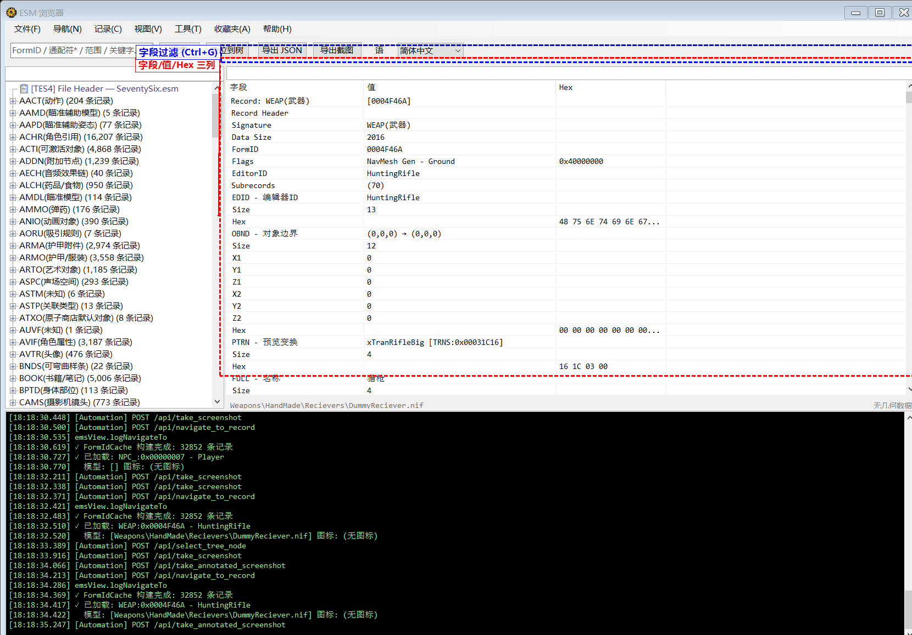
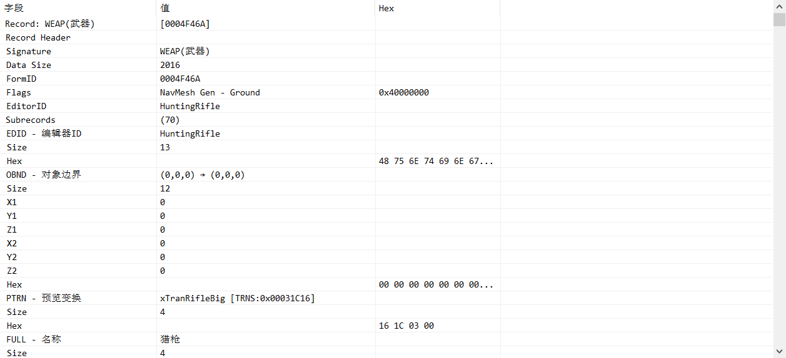

# 详情面板与交互



## 详情树结构

右侧详情面板使用 TreeListView（ObjectListView）控件，以三列展示记录数据:

| 列名 | 说明 |
|------|------|
| **字段** | 子记录签名和字段名称（如 `EDID - EditorID`、`FULL - Name`） |
| **值** | 解析后的人类可读值 |
| **Hex** | 原始十六进制数据 |

### 记录头信息

每条记录的详情树顶部显示 Record Header:
- Record Signature（类型签名）
- FormID
- Flags（记录标志位）
- Version

### 子记录解析

程序内置了丰富的子记录解析逻辑，能将原始二进制数据解析为可读格式:
- 基础类型: 字符串、整数、浮点数、FormID 引用
- 复合结构: OBND（边界框）、ACBS（角色基础数据）、DNAM（武器/装甲数据）等
- DATA 特化: 针对 WTHR（天气）、REGN（区域）、HAZD（危险区域）等类型有专门解析
- FO76 专用: PAHD、OBST、CTRN、FFEF、AIID、PHST 等 Fallout 76 特有子记录

## FormID 蓝色链接



### 识别规则

当详情树的 **值** 列包含有效的 FormID 引用时（格式含 `0x`），会自动显示为:
- **蓝色文字** + **下划线** 样式
- 与网页超链接的视觉风格一致

### 鼠标光标

- 鼠标移动到蓝色 FormID 链接上时，光标变为 **手型** (Hand cursor)
- 移开后恢复默认光标

### 悬停提示 (Tooltip)

将鼠标悬停在蓝色 FormID 链接上，会显示目标记录的提示信息:
```
[WEAP] 0x001234AB
WeaponLaserPistol
激光手枪
```

提示内容包括:
- 目标记录的类型签名（如 [WEAP]、[ARMO]）
- FormID
- EditorID
- FullName（如有字符串数据）

### 跳转操作

有三种方式可以通过蓝色链接跳转到目标记录:

| 操作 | 说明 |
|------|------|
| **双击** | 双击蓝色链接，直接跳转到目标记录 |
| **Ctrl + 左键单击** | 按住 Ctrl 点击蓝色链接，跳转到目标记录 |
| **右键 → 跳转到此记录** | 右键菜单方式跳转 |

所有跳转操作都会记录到导航历史中，可通过后退/前进返回。

## 左侧树过滤

- **位置**: 左侧面板顶部的过滤框
- **快捷键**: `/` 键聚焦
- **功能**: 实时过滤左侧树中的记录
- **防抖**: 输入后 250ms 延迟执行过滤（避免频繁刷新）
- **Enter**: 按 Enter 跳转到过滤后的第一条记录
- **Esc**: 按 Esc 清空过滤

## 详情字段过滤

- **位置**: 右侧详情面板顶部的过滤框
- **快捷键**: `Ctrl + G` 聚焦
- **功能**: 在当前记录的详情树中按字段名/值过滤
- **防抖**: 300ms 延迟
- **Esc**: 按 Esc 清空过滤

## 分页加载

当某类型的记录数量超过阈值时，左侧树会自动分页:
- 每页固定数量的记录
- 显示为 `#1 - #500 (共 2000 条)` 格式的分页节点
- 点击分页节点自动加载该页数据
- 分页内的记录支持正常的选择和查看

## 3D 模型预览

当选中的记录包含 NIF 模型路径时，右侧面板下方会显示 3D 模型预览:
- 自动从 BA2 中提取 NIF 文件
- 转换为 GLB 格式后渲染显示
- 支持导出 GLB 文件和预览截图

## 纹理预览

当记录关联纹理文件时，显示纹理预览:
- 支持从 BA2 中提取纹理
- 提供「适应窗口」缩放功能

## TES4 文件头

加载 ESM 后，左侧树顶部会显示 `📋 [TES4] File Header` 节点:
- 点击可查看 ESM 文件的元信息
- 包含版本号、记录总数、Master 依赖列表
- Master 列表显示每个依赖文件的索引和文件名

## CELL 地图可视化

对于 Worldspace 节点，右键可选择 **查看地图 (&W)**:
- 以 2D 地图方式展示该世界空间中所有 CELL 的位置分布
- 每个 CELL 显示为地图上的一个点
- 点击 CELL 可跳转到对应记录
- 坐标来自 XCLC 子记录
